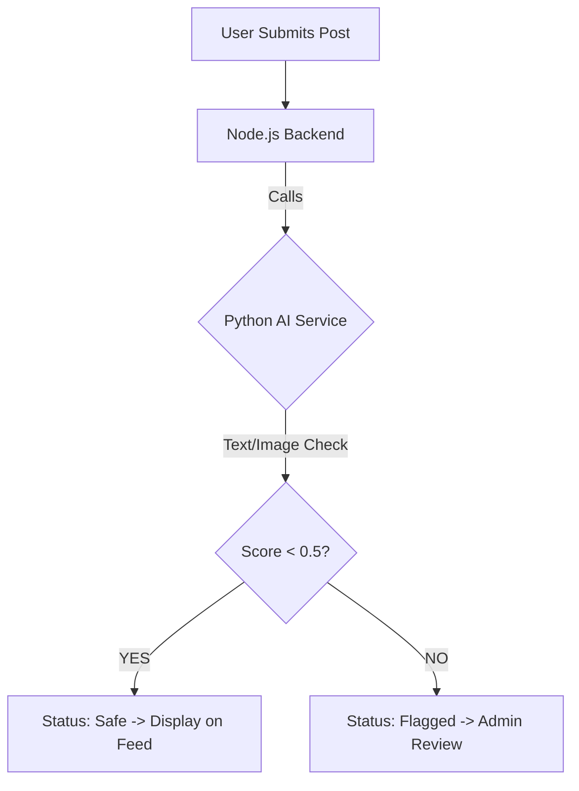

# SafeStream-: Intelligent Content Moderation Platform

SafeStream- is a modern web application designed to create a safer online environment by implementing real-time, AI-powered content moderation. It automatically scans user-generated content (both text and images) to ensure it adheres to safety guidelines before being published.

---
### **Ayushman Giri**
*Overseeing full-stack integration, database architecture, and machine learning moderation.*

---

##  Core Project Team

| Service | Contributor |
| :--- | :--- |
| **Frontend** | Aman Soni |
| **Node Backend** | Hari Om |
| **AIML & Deployment** | Ayushman Giri & Radhika |

---

## Key Features

- **Flexible Content Submission**: Support for text-only, image-only, or text+image posts.
- **Real-Time AI Moderation**: Automated analysis of harmful language or inappropriate imagery.
- **Dynamic Content Feed**: Safe content is published immediately.
- **Flagging System**: Suspicious content is sent for manual review.
- **Modern UI**: Fast, responsive interface with real-time status updates.

---

##  Technical Architecture

SafeStream- follows a microservices architecture:

1. **Frontend**: React + Vite + Tailwind CSS.
2. **Backend**: Node.js + Express + MongoDB + Cloudinary.
3. **AI Service**: Python + FastAPI + Transformers.

### Content Logic


---

## Setup & Installation

Follow these steps to run the project locally.

### 1. Prerequisites
- Node.js (v18+)
- Python (v3.9+)
- MongoDB Atlas account or local MongoDB
- Cloudinary account (for image uploads)

### 2. Backend Setup (Node.js)
```bash
cd backend
npm install
```
- Create a `.env` file in `backend/` and add:
```env
PORT=4000
MONGODB_URI=your_mongodb_uri
JWT_SECRET=your_secret
CLOUD_NAME=your_cloudinary_name
API_KEY=your_cloudinary_key
API_SECRET=your_cloudinary_secret
```
- Run the server:
```bash
npm run dev
```

### 3. AI Service Setup (Python)
```bash
cd backend/ai_service
pip install -r requirements.txt
```
- Run the AI service:
```bash
uvicorn main:app --reload --port 8001
```

### 4. Frontend Setup (React)
```bash
cd frontend
npm install
```
- Run the frontend:
```bash
npm run dev
```

---

##  Run with Docker (Recommended)

You can run the entire SafeStream- platform using Docker and Docker Compose. This starts the backend, frontend, and AI service automatically.

### Prerequisites
- [Docker Desktop](https://www.docker.com/products/docker-desktop/) installed and running.

### Steps
1. **Prepare Environment Variables**:
   Ensure you have a `.env` file in the `backend/` directory as described in the [Backend Setup](#2-backend-setup-nodejs) section.

2. **Build and Start**:
   From the root directory, run:
   ```bash
   docker-compose up --build
   ```

3. **Access the Services**:
   - **Frontend**: [http://localhost:5173](http://localhost:5173)
   - **Backend API**: [http://localhost:4000](http://localhost:4000)
   - **AI Service**: [http://localhost:8001](http://localhost:8001)

4. **Stop the Services**:
   ```bash
   docker-compose down
   ```

---

##  Moderation Logic
The AI service evaluates content using several models:
- **Text**: Checked for toxicity, spam, and harmful sentiment.
- **Image**: Checked for explicit content or policy violations.
- **Final Decision**: If either score exceeds **0.5**, the content is flagged for manual review.

---
*Developed with ❤️ by the SafeStream- Team: **Ayushman Giri**, Aman Soni, Hari Om, and Radhika.*
