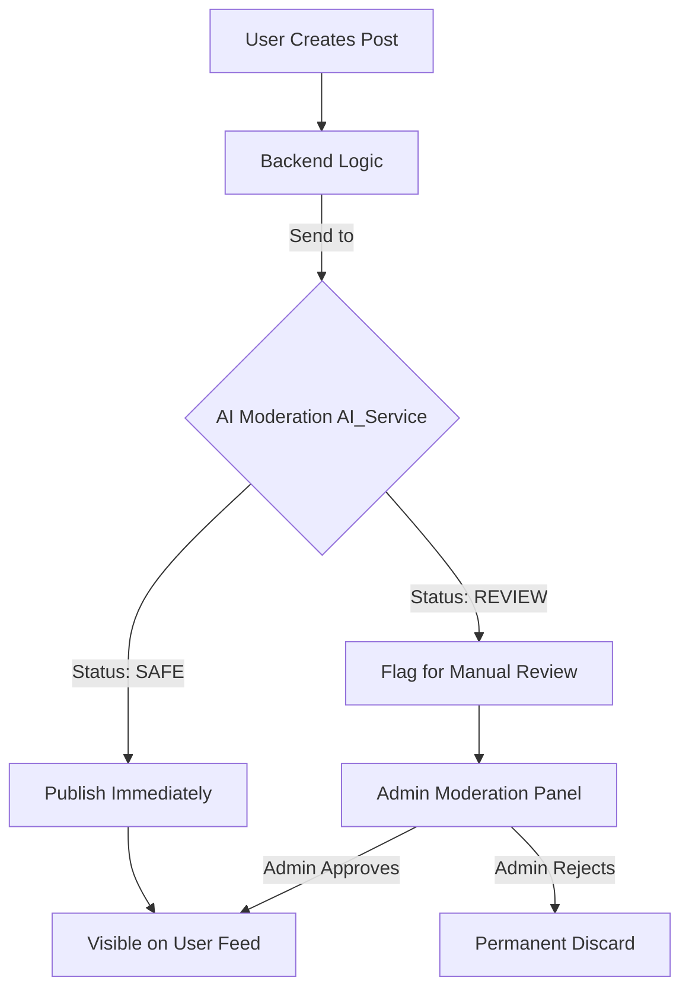

# SafeStream-: Intelligent Content Moderation Platform

SafeStream- is a modern web application designed to create a safer online environment by implementing real-time, AI-powered content moderation. It automatically scans user-generated content (both text and images) to ensure it adheres to safety guidelines before being published.

##  Key Features

- **Flexible Content Submission**: Support for text-only, image-only, or text+image posts.
- **Dynamic Content Feed**: Displays safe, approved content to all users immediately.
- **Moderation Workflow**: Flagged content is sent for manual review, allowing admins to approve or reject sensitive posts.
- **Unified Safety Scoring**: Combines text and image safety scores using a threshold-based algorithm.
- **Seamless User Experience**: High-performance frontend with immediate feedback on content safety.

##  Technical Architecture

SafeStream- follows a modern microservice-inspired architecture:

1. **Frontend (Client)**: Built with **React** and **Vite**, offering a fast and responsive UI for users to create posts and view the feed.
2. **Backend (Server)**: A **Node.js/Express** server that handles business logic, user authentication, and data persistence with **MongoDB**.
3. **AI Moderation Service**: A dedicated **Python** service (FastAPI/Flask) that evaluates content safety using advanced ML models.

### The Content Flow

##  Tech Stack

| Layer | Technology |
| :--- | :--- |
| **Frontend** | React, Vite, Tailwind CSS, Axios |
| **Backend** | Node.js, Express.js, MongoDB (Mongoose) |
| **AI Service** | Python, ML Models (NLTK/TensorFlow/PyTorch) |
| **Storage** | Cloudinary (Images), Local Storage |

##  How Moderation Works

The moderation logic is handled by the `moderateContent` service. When a user submits a post:
1. The backend sends the text and image URL to the Python-based AI service.
2. The AI calculates a **Safety Score** (0.0 to 1.0).
3. If the score exceeds a threshold (default 0.5) or is explicitly flagged as "REVIEW", the post is marked as `flagged`.
4. If the content is clean, it is marked as `safe` and appears on the feed instantly.

##  Repository Structure

- `backend/`: Node.js server, API routes, controllers, and database models.
- `frontend/`: React application and UI components.
- `docs/`: Project documentation and architecture details.
- `ai_service/`: (Optional/Internal) Python logic for machine learning moderation.

---
*Designed & Architected by **Ayushman Giri** for the SafeStream- Platform.*
